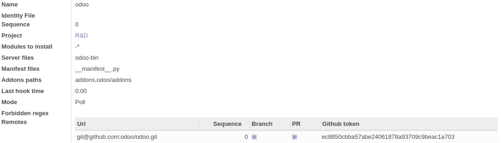
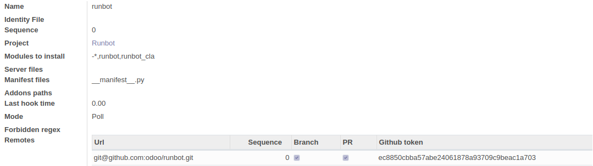
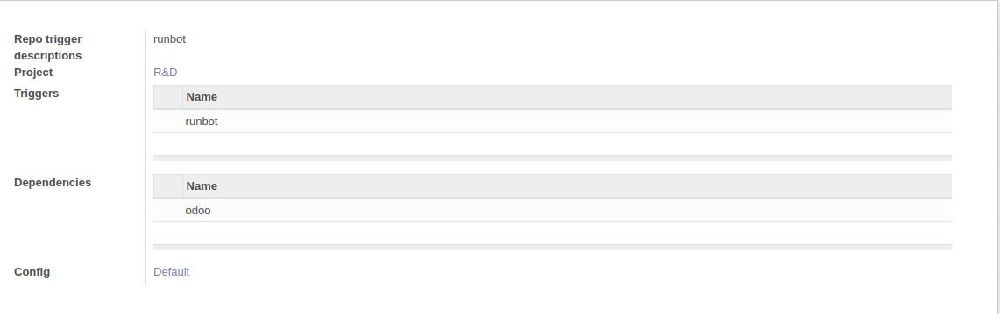

# Odoo Runbot Repository

This repository contains the source code of Odoo testing bot [runbot.odoo.com](http://runbot.odoo.com/runbot) and related addons.

------------------

## Warnings

**Runbot will delete folders/ drop databases to free some space during usage.** Even if only elements created by runbot are concerned, don't use runbot on a server with sensitive data.

**Runbot changes some default odoo behaviours** Runbot database may work with other modules, but without any guarantee. Avoid using runbot on an existing database/install other modules than runbot.

## Glossary/models

Runbot v5 use a set of concept in order to cover all the use cases we need

- **Project**: regroups a set of repositories that works together. Usually one project is enough and a default *R&D* project exists.
- **Repository**: A repository name regrouping repo and forks Ex: odoo, enterprise
- **Remote**: A remote for a repository. Example: odoo/odoo, odoo-dev/odoo
- **Build**: A test instance, using a set of commits and parameters to run some code and produce a result.
- **Trigger**: Indicates that a build should be created when a new commit is pushed on a repo. A trigger has both trigger repos, and dependency repo. Ex: new commit on runbot-> build with runbot and a dependency with odoo.
- **Bundle**: A set or branches that work together: all the branches with the same name and all linked pr in the same project.
- **Batch**: A container for builds and commits of a bundle. When a new commit is pushed on a branch, if a trigger exists for the repo of that branch, a new batch is created with this commit. After 60 seconds, if no other commit is added to the batch, a build is created by trigger having a new commit in this batch.

## HOW TO

This section give the basic steps to follow to configure the runbot v5.0. The configuration may differ from one use to another, this one will describe how to test addons for odoo, needing to fetch odoo core but without testing vanilla odoo. As an exemple, runbot will be used as a tested addons.

### Setup

Runbot is an addon for odoo, meaning that both odoo and runbot code are needed to run. Some tips to configure odoo are available in [odoo setup documentation](https://www.odoo.com/documentation/13.0/setup/install.html#setup-install-source) (requirements, postgres, ...) This page will mainly focus on runbot specificities.

Choose a workspace and clone both repositories.

```
git clone https://github.com/odoo/odoo.git
git clone https://github.com/odoo/runbot.git
```

Runbot depends on some odoo version, runbot v5.0 is currently based on odoo 13.0 (Runbot 13.0.5.0). Both runbot and odoo 13.0 branch should be chekouted. *This logic follows the convention imposed by runbot to run code from different repositories, the branch name must be the same or be prefixed by a main branch name.*

```
git -C odoo checkout 13.0
git -C runbot checkout 13.0
```

### Specific requirements

You will also need to install docker on your system. The user that will be used to operate the runbot must also have access to the Docker commands. On Debian like system's , it's only a matter of adding the user to the `docker` group.

```
sudo adduser $USER docker
```

The only specific python requirement is the `matplotlib` library.

```
sudo apt install python3-matplotlib
```

### Install and start runbot

Runbot being an odoo addon, you need to start odoo giving runbot in the addons path. Install runbot by giving the -i instruction.

```
python3 odoo/odoo-bin -d runbot_database --addons-path odoo/addons,runbot -i runbot --stop-after-init --without-demo=1
```

Then, launch runbot

```
python3 odoo/odoo-bin -d runbot_database --addons-path odoo/addons,runbot --limit-memory-soft 4294967296 --limit-memory-hard 4311744512 --limit-time-real-cron=1800
```

Note:
- --limit-time-real-cron is important to ensure that cron has enough time to build docker images and clone repos the first time. It may be reduced to a lower value later (600 is advised).
- --limit-memory-* is not mandatory, but fetching odoo on multiple remote with only 2Gib may result in a failure of the fetch command. If git fails to create async thread or run out of memory, increasing memory limit may be a good idea. *cf. odoo-bin --help for more info.*

You may want to configure a service or launch odoo in a screen depending on your preferences.

### Configuration

*Note: Runbot is optimized to run commit discovery and build scheduling on different hosts to allow load share on different machines. This basic configuration will show how to run runbot on a single machine, a less-tested use case*

#### Bootstrap
Once launched, the cron should start to do basic work. The commit discovery and build scheduling is disabled by default, but runbot bootstrap will start to setup some directories in static.
>Starting job `Runbot`.
```
ls runbot/runbot/static
```
>build  docker  nginx  repo  sources  src

- **repo** contains the bare repositories
- **sources** contains the exported sources needed for each build
- **build** contains the different workspaces for dockers, containing logs/ filestore, ...
- **docker** contains DockerFile and docker build logs
- **nginx** contains the nginx config used to access running instances
All of them are empty for now.

A database defined by *runbot.runbot_db_template* icp will be created. By default, runbot use template1. This database will be used as a template for testing builds. You can change this database for more customisation.

Other cron operations are still disabled for now.

#### Access backend
Access odoo "backend" *127.0.0.1:8069/web*

If not connected yet, connect as admin (default password: admin). You may want to check that.Check odoo documentation for other needed configuration as master password. This is mainly needed for production purpose, a local instance will work as it is.
If you create another Odoo user to manage the runbot, you may add the group *Runbot administrator* to this user

#### Add remotes and repositories
Access runbot app and go to the Repos->Repositories menu

Create a new repo for odoo


- A single remote is added, the base odoo repo. Only branches will be fetched to limit disc usage and branches will be created in the backend. It is possible to add multiple remotes for forks.

- The repo is in poll mode since github won't hook your runbot instance. Poll mode is limited to one update every 5 minutes.

- The modules to install pattern is -* in order to disable default module to test for this repo. This will speed up installation. To install and test all modules, leave this space empty or use \*. Some modules may be blacklisted individually, by using *-module,-other_module, l10n_\*.

- Server files will allow runbot to know the possible file to use to launch odoo. odoo-bin is the one to use for the last version, but you may want to add other server files for older versions (comma separated list). The same logic is used for manifest files.

- Addons path is the place where addons directories are located. This will be used for addon-path parameters but also for module discovery.

Create a repo for you custom addons repo

- For your custom repo, it is advised to configure the repo in hook mode if possible. 
- No server files should be given since it is an addons repo.
- No addons_path given to use repo root as default.
- we only want to test runbot and runbot_cla on runbot, `-*,runbot,runbot_cla` will blacklist all except this ones
- The remote PR option can be checked to fetch pull request too if a github token is given for this repo.

#### Tweak runbot parameters and enable features

Acces the runbot settings and tweak the default parameters.
- The *number of worker* is the default number of parallel testing builds per machine. It is advised to keep one physical core per worker on a dedicated machine. On a local machine,keep it low, **2** is a good start (using 8 on runbot.odoo.com).

- The *number of running build* is the number of parallel running builds. Runbot will start to kill running builds once this limit is reached. This number can be pumped up on a server (using 60 on runbot.odoo.com).
- *Runbot domain* will mainly be used for nginx to access running builds.
- Max commit age is the limit after which a branch head will be ignored in processing. This will reduce the processing of old non deleted branches. Keep in mind that pushing an old commit on a branch will also be ignored by runbot.

- **Discover new commits** is disabled by default but is needed to fetch repositories and create new commits/batches/builds. **Check** this option.

- **Discover new commits** is needed to fetch repositories and create new commits/batches/builds. **Check** this option.

- **Schedule builds** is needed to process pending/testing. **Check** this option. To use a dedicated host to schedule builds, leave this option unchecked and use the dedicated tool in runbot/builder.

Save the parameter. The next cron execution should do a lot of setup.
NOTE: The default limit_time_real-cron should be ideally set to at least 1800 for this operation.
- If schedule builds is checked, the first time consuming operation will be to build the docker image. You can check the current running dockers with `docker ps -a`. One of them should be up for a few minutes. If the build is not finished at the end of the cron timeout, docker build will either resolve its progress and continue the next step, but could also fail on the same step each time and stay stuck. Ensure to have limit-time-real-cron high enough, depending on your bandwidth and power this value could be 600-1800 (or more). Let's wait and make a coffee. You can also check progress by tailing runbot/static/docker/docker_build.txt

- The next git update will init the repositories, a config file with your remotes should be created for each repo. You can check the content in /runbot/static/repo/(runbot|odoo)/config. The repo will be fetched, this operation may take some time too.

Those two operations will be faster on next executions.

Finally, the first new branches/batches should be created. You can list them in Bundle > Bundles.

#### Bundles configuration

We need to define which bundle are base versions (master should already be marked as a base). In runbot case we only need 13.0 but all saas- and numerical branches should be marked as base in a general way. A base will be used to fill missing commits in a batch if a bundle doesn't have a branch in each repo, and will trigger the creation of a version. Versions may be used for upgrade test.

Bundles can also be marked as `no_build`, so that new commit won't create batch creation and the bundle won't be displayed on the main page.

#### Triggers
At this point, runbot will discover new branches, new commits, create bundle, but no build will be created.

When a new commit is discovered, the branch is updated with a new commit. Then this commit is added in a batch, a container for new builds when they arrive, but only if a trigger corresponding to this repo exists. After one minute without a new commit update in the batch, the different triggers will create one build each.
In this example, we want to create a new build when a new commit is pushed on runbot, and this build needs a commit in odoo as a dependency.



Note that the used config is default. It is advised to customize this config. In our example, adding */runbot,/runbot_cla* test-tags on config step *all* may be a good idea to speed up testing by skipping tests from dependencies.

When a branch is pushed, a new batch will be created, and after one minute the new build will be created if no other change is detected. The build remains in pending state for now. Check the result on 127.0.0.1:8069/runbot

CI options (not on screeshot) will only be used to send status on remotes of trigger repositories having a valid token.

#### Hosts
Runbot is able to share pending builds across multiple hosts. In the present case, there is only one. A new host will never assign a pending build to himself by default.
Go in the Build Hosts menu and choose yours. Uncheck *Only accept assigned build*. You can also tweak the number of parallel builds for this host.

### Modules filters
Modules to install can be filtered by repo, and by config step. The first filter to be applied is the repo one, creating the default list for a config step.
Addon -module on a repo will remove the module from the default, it is advised to reflect the default case on repo. To test only a custom module, adding *-\** on odoo repo will disable all odoo addons. Only dependencies of custom modules will be installed. Some specific modules can also be filtered using *-module1,-module1* or somme specific modules can be kept using *-\*,module1,module2*
Module can also be filtered on a config step with the same logic as repo filter, except that repo's blacklist can be disabled to allow all modules by starting the list with *\** (all available modules)
It is also possible to add test-tags to config step to allow more module to be installed but only testing some specific one. Test tags: */module1,/module2*

### db template
Db creation will use template0 by default. It is possible to specify a specific template to use in runbot config *Postgresql template*. It is mainly used to add extensions by default.


## Dockerfiles

Runbot is using a Dockerfile Odoo model to define the Dockerfile used for builds and is shipped with a default one. This default Dockerfile is based on Ubuntu Bionic and is intended to build recent supported versions of Odoo (currently 12.0 up to 14.0).

The model is using Odoo QWeb views as templates.

A new Dockerfile can be created as needed either by duplicating the default one and adapt parameters in the view. e.g.: changing the key `'from': 'ubuntu:bionic'` to `'from': 'debian:buster'` will create a new Dockerfile based on Debian instead of ubuntu.
Or by providing a plain Dockerfile in the template.

Once the Dockerfile is created and the `to_build` field is checked, the Dockerfile will be built (pay attention that no other operations will occur during the build).

A version or a bundle can be assigned a specific Dockerfile.
