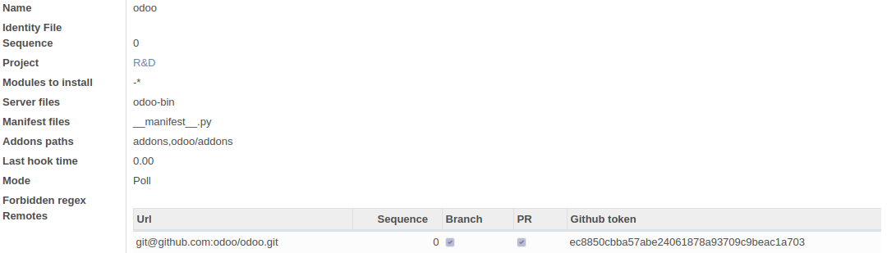
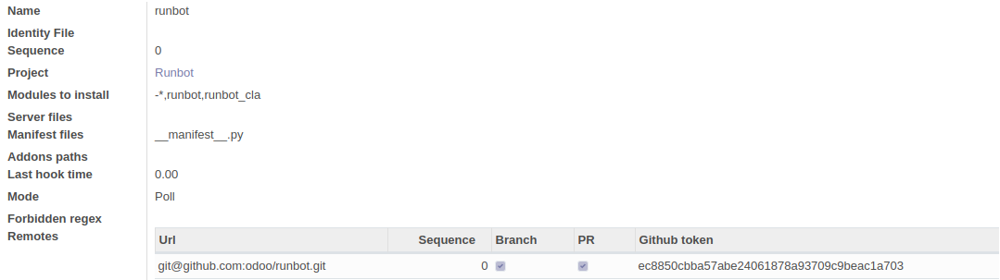

# Odoo Runbot Repository

This repository contains the source code of Odoo testing bot [runbot.odoo.com](http://runbot.odoo.com/runbot) and related addons.

------------------

## Warnings

**Runbot will delete folders/drop databases to free some space during usage.** Even if only elements created by runbot are concerned, don't use runbot on a server with sensitive data.

**Runbot changes some default odoo behaviours** Runbot database may work with other modules, but without any guarantee.

**Runbot is not safe by itself** This tutorial describes the minimal way to deploy runbot, without security considerations. Only trusted code should be executed with this single machine setup. For more security the builder should be deployed separately with minimal access.

## Glossary/models
Runbot encodes concepts that cover all the testing and validation use-cases for maintaining Odoo projects:

- **Project**: Logical grouping of repositories that are related to each other. Usually one project is enough and a default *R&D* project is automatically created.
- **Repository**: Logical grouping of remotes. Usually you create *odoo* and *enterprise*.
- **Remote**: A location to find (Git) repository information. Example: odoo/odoo, odoo-dev/odoo
- **Bundle**: A group of matched[^1] branches across repositories eg, odoo/odoo/19.0 matches odoo/enterprise/19.0. Usually you see one bundle for every discovered branch (including PRs).
- **Batch**: A group of commits, for all branches defined by the parent bundle. These commits build together.[^2]
- **Trigger**: Logic to automate creation of build instances. At a minimum you need one trigger per project to build new code eg, a new commit on odoo/odoo -[automatic batch creation]-> new batch -[trigger]-> new build to run odoo tests.
- **Build**: Represents the execution of odoo, in practice this is when testing happens (`odoo-bin --tests-enabled <..>` is launched).[^3] Builds generally execute code and produce output (logs, build artifacts, running odoo instance for testing).


[^1]: Matching only links related repositories within the same project.  
[^2]: Batches are created automatically by the parent bundle after detection of new commits.  
[^3]: By default, build creation is delayed until 60 seconds (debounce) after the most recent commit on the linked batch. This debounce value is part of the project configuration.  

## Processes

Mainly to allow to distribute runbot on multiple machine and avoid cron worker limitations, the runbot is using 2 processes besides the main server.

- **runbot web process**: The main runbot process serving web requests. A typical Odoo instance (odoo-bin process).
- **leader process**: This process should only be started once, detect new commits and creates builds for builders.
- **builder process**: This process can run at most once per physical host, will execute the builds assigned to themselves.

## Operational requirements

You can safely skip ahead to [First steps with Runbot](#first-steps-with-runbot) if you are interested in trying out Runbot.  
This section lists Runbot's expectations for the platform it's running on and configuration examples.

### DNS

You may configure a DNS entry for your runbot domain as well as a CNAME for all subdomain.

```
;; The documentation writer assumes the reader knows how to interpret this fragment of code.
;; The reader can also skip DNS configuration to use Runbot with a limited feature set.

$ORIGIN domain.com.
runbot.domain.com.  IN A      127.0.0.1
*                   IN CNAME  runbot.domain.com.
```

This configuration is not necessary for a minimal setup.  
You need similar domain setup to deploy Runbot in a production environment that gives access to running test database and test artifacts.

### nginx

An example of config is given in the `example_scripts` folder.

This may be adapted depending on your setup, mainly for domain names. This can be adapted during the install but serving at least the runbot frontend (proxy pass `80` to `8069`) is the minimal config needed.
Note that runbot also has a dynamic nginx config listening on the `8080` port, mainly for running build.

This config is an `ir_ui_view` (runbot.nginx_config) and can be edited if needed. The config is applied and updated automatically after some time by the builder process.

It is also advised to adapt this config to work in `https`.

### Running unattended

The directory [./runbot/runbot/example_scripts]() has example configuration to launch every Runbot process. This section explains how to configure Systemd to run Runbot unattended.

NOTE: This part assumes a dedicated user 'runbot' exists for running Runbot and accessing docker and postgresql.

Copy the runbot launch scripts to a known static location on the system.  
If you want to store your launch scripts elsewhere, update the `ExecStart` parameter inside the systemd service unit files to match.

```bash
workspace="/home/runbot/odoo/"

su runbot
mkdir ~/bin
cp -r "${workspace}/runbot/runbot/example_scripts/runbot" ~/bin/runbot
```

Create the corresponding services. You can copy them from the example scripts and adapt them:

```bash
exit # go back to a sudoer user

runbot_user="runbot"
sudo cp "${workspace}/runbot/runbot/example_scripts/services/*" /etc/systemd/system/
sudo sed -i "s/runbot_user/${runbot_user}/" /etc/systemd/system/runbot.service
sudo sed -i "s/runbot_user/${runbot_user}/" /etc/systemd/system/leader.service
sudo sed -i "s/runbot_user/${runbot_user}/" /etc/systemd/system/builder.service
```

Enable all services and start the runbot frontend.

```bash
sudo systemctl daemon-reload

sudo systemctl enable runbot
sudo systemctl enable leader
sudo systemctl enable builder

sudo systemctl start runbot
sudo systemctl status runbot
```

Ensure startup completed succesfully, then start and verify the other runbot processes too.  
Several log files should have been created in `/home/runbot/odoo/logs/`, one per service.

## First steps with Runbot

Follow along to get a new Runbot instance configured that tests code from this (Runbot) repository. Runbotception!  
Note that Runbot runs on top of Odoo community and we'll not be testing Odoo community itself.

You most likely want to divert from these instructions to better support your own use case.

### Requirements

Runbot is an addon for odoo, meaning that both odoo and runbot repositories are needed to launch Runbot. The information below guides you through installation of git, python+dependencies, postgresql as those are Odoo dependencies.

1. [Prepare - Odoo source install](https://www.odoo.com/documentation/19.0/administration/on_premise/source.html#prepare)
2. [Run the server - Odoo setup guide](https://www.odoo.com/documentation/19.0/developer/tutorials/setup_guide.html#run-the-server)


Install Runbot dependencies.

```bash
sudo apt-get install docker.io python3-unidiff python3-docker python3-matplotlib
```

Choose a workspace to clone both repositories and checkout the default branch in both of them.
The directory used in example scripts is `/home/$USER/odoo/` 

Note: It is highly advised to create a dedicated user for runbot.

```bash
# This example creates a new unix user `runbot` with permissions to use docker and postgresql.

sudo adduser runbot

# needed access rights, docker, postgress
sudo -u postgres createuser -d runbot
sudo adduser runbot docker
sudo systemctl restart docker

# no sudo power needed for now

su runbot
cd
mkdir odoo
cd odoo
```

You may [add a valid ssh key to a github account](https://docs.github.com/en/authentication/connecting-to-github-with-ssh/adding-a-new-ssh-key-to-your-github-account)
 to be used by user `runbot` to clone the next repositories. You could clone in `https` but this may be a problem later to access your private repositories.  
It is important to clone the repositories as the runbot user:

```bash
git clone --depth=1 --branch=19.0 git@github.com:odoo/odoo.git
git clone git@github.com:odoo/runbot.git

git -C odoo checkout 19.0
git -C runbot checkout 19.0

mkdir logs
```

Note: `--depth=1 --branch=19.0 ` is optional but this approach requires less available disk space. The odoo community and odoo enterprises repositories are large, monitor your free disk space regularly when you use them inside Runbot. (50+ GiB at minimum)

Finally, check that you have access to docker, listing the docker containers should work without error (but the list will be empty).

```bash
docker ps 
```
If the command returns an error, add the unix user to the 'docker' group and logout/login again.


#### Install runbot database

Initialise a new Odoo database with Runbot automatically installed.

```bash
workspace="/home/$USER/odoo/"

"$workspace/odoo/odoo-bin" --addons-path "$workspace/odoo/addons,$workspace/runbot" -d runbot -i runbot --stop-after-init
```

This is all the preparation necessary to start every runbot process. Usually you'll start each of them in the proper order.

### Runbot process

All requirements are met, go ahead and launch!

```bash
# Launch the Runbot web service
"$workspace/runbot/runbot/example_scripts/runbot/runbot.sh"
```

You can now connect to your running instance and configure runbot.
- Page [http://127.0.0.1:8069]() shows an empty bundle overview page. Nothing is configured yet.
- Log into the backend as admin (default password: admin).
- Visit page [Runbot > Settings > Settings](http://127.0.0.1:8069/odoo/settings) to update your instance settings:
    - `Default number of workers` equals the maximum number of builds to run in parallel, consider setting the value to `#cpu - 1`.
    - Modify `Default odoorc for builds` to change the running build master password to something unique ([ideally a hashed one](https://github.com/odoo/odoo/blob/master/odoo/tools/config.py#L1148)).
    - Tweak the garbage collection settings, if you have limited disk space.
    - `Max running builds` equals the maximum number of builds that remain externally accessible in parallel. These are the odoo-instances intended for manual intergration testing.
    - `Max commit age (in days)` ensures new commits are created recently. Increase this limit in exceptional cases to detect older branches.

If you intend to run this Runbot instance in a production environment, read through the Odoo documentation to secure it properly.  
- Update the instance master password, which is used at the `/web/database/manager` endpoint. ([More info here](https://www.odoo.com/documentation/19.0/administration/on_premise/deploy.html#reset-the-master-password))
- Change the login credentials of the admin user

### Leader process

All requirements are met, go ahead and launch!

```bash
# Launch the Runbot leader process
"$workspace/runbot/runbot/example_scripts/runbot/leader.sh"
```

Right away the leader process will not do anything, an instance admin must assign the leader role to this process first.
- Open the backend, navigate to Runbot > Hosts
- Open the record with hostname 'leader' (configurable name, see 'forced-host-name' parameter)
- Enable options `Is leader` and `Is assigner`, disable `Is builder`, then save

Observe the leader process stopped writing "..is not a leader host.." to the console.


### Builder process

The launch script `builder.sh` should be adapted, specifically the `forced-host-name` parameter value:

```bash
sed -i "s/runbot.domain.com/runbot.my_real_domain.com/" ~/bin/runbot/builder.sh
```

*The host name equals the machine hostname and cannot be changed from the backend. The host name should be different per process, having the same host name for leader and builder is not ideal. The forced-host-name parameter is available to manually set a custom host name when launching the process.*

Note: The host name of the builder process must match your DNS configuration (resolvable domain name). Runbot uses the host name to construct URLs for running builds (live test-instances), artifact downloads and log files. This value should be a fully qualified domain name that includes your real domain.  
The example nginx configuration file demonstrates how to accept and proxy incoming connections on the builder process host.

#### DOCKER images
A default docker image (name 'DockerDefault') record is present in the database. The corresponding docker image should be built automatically by builder processes.  
The code you're trying to build/test may require additional preinstalled dependencies. The recommended approach is to modify the default Dockerfile to match your situation.

The Odoo Runbot team maintains a set of prebuilt docker images that are compatible with actively supported Odoo versions. Ask them for a link to use in your own Runbot.

#### Bootstrap
# --- TODO

Once launched, the leader process should start to do basic work and bootstrap will start to setup some directories in static.

```bash
su runbot
ls ~/odoo/runbot/runbot/static
```

>build  docker  nginx  repo  sources  src

- **repo** contains the bare repositories
- **sources** contains the exported sources needed for each build
- **build** contains the different workspaces for dockers, containing logs/ filestore, ...
- **docker** contains DockerFile and docker build logs
- **nginx** contains the nginx config used to access running instances
All of them are empty for now.

A database defined by *runbot.runbot_db_template* icp will be created. By default, runbot use template0. This database will be used as a template for testing builds. You can change this database for more customisation.

Other cron operations are still disabled for now.


## Test Runbot code
All the Runbot processes are running and provisioned with basic configuration.  
This section explains the configuration to achieve automated Runbot testing.

### Repositories and remotes
Access runbot app and go to the `Runbot>Setting>Repositories` menu

Create a new repo for odoo


- **Name**: `odoo` It will be used as the directory name to export the sources.
- **Identity File** is only useful if you want to use another ssh key to access a repo.
- **Project**: `R&D` by default.
- **Modules to install**: `-*` in order to remove them from the default `-i`. This will speed up installation. To install and test all modules, leave this space empty or use `*`. Some modules may be blacklisted individually, by using `*-module,-other_module, l10n_*`.
- **Server files**: `odoo-bin` will allow runbot to know the possible file to use to launch odoo. `odoo-bin` is the one to use for the last version, but you may want to add other server files for older versions (comma separated list). The same logic is used for manifest files.
- **Manifest files**: `__manifest__.py`. This field is only useful to configure old versions of odoo.  
- **Addons path**: `addons,odoo/addons`. The paths where addons are stored in this repository.
- **Mode**: `poll` since github won't hook your runbot instance. Poll mode is limited to one update every 5 minutes. *It is advised to set it in hook mode later and hook it manually of from a cron or automated action to have more control*.
- **Remotes**: `git@github.com:odoo/odoo.git` A single remote is added, the base odoo repo. Only branches will be fetched to limit disk usage and branches will be created in the backend. It is possible to add multiple remotes for forks.

Create another project for your repositories `Runbot>Setting>Project`

This is optionnal you could use the R&D one, but this may be more noisy since every update in odoo/odoo will be displayed on the same page as your own repo one. Splitting by project also allows to manage access rights. 

Create a repo for your custom addons repo

- **Name**: `runbot`
- **Project**: `runbot`.
- **Modules to install**: `-*,runbot` to only install the runbot module.
- **Addons path**: No `addons_path` given to use repo root as default.
- (optionnal) For your custom repo, it is advised to configure the repo in `hook` mode if possible, adding a webhook on `/runbot/hook`. Use `/runbot/hook/<repo_id>` to do it manually.
- **Remotes**: `git@github.com:odoo/runbot.git` 
- The remote *PR* option can be checked if needed to fetch pull request too. Will work only if a github token is given for this repo.

A config file with your remotes should be created for each repo. You can check the content in `/runbot/static/repo/(runbot|odoo)/config`. The repo will be fetched, this operation may take some time too. After that, you should start seeing empty batches in both projects on the frontend (`/` or `/runbot`)

### Triggers and linked config
At this point, runbot will discover new branches, new commits, create bundle, but no build will be created.

When a new commit is discovered, the branch is updated with a new commit. Then this commit is added in a batch, a container for new builds when they arrive, but only if a trigger corresponding to this repo exists. After one minute without a new commit update in the batch, the different triggers will create one build each.
In this example, we want to create a new build when a new commit is pushed on runbot, and this build needs a commit in odoo as a dependency.

By default the basic config will use the step `all` to test all addons. The installed addons will depends on the repo configuration, but all dependencies tests will be executed too.
This may not be wanted because some `base` or `web` test may be broken. This is the case with runbot addons. Also, selecting only the test for the addons
we are interested in will speedup the build a lot.

Even if it would be better to create new Config and steps, we will modify the curent `all` config step.

`Runbot > Configs > Build Config Steps`

Edit the `all` config step and set `/runbot` as **Test tags**

We can also check the config were going to use:

`Runbot > Configs > Build Config`

Optionnaly, edit `Default no run` config and remove the `base` step. It will only test the module base.

Config and steps can be usefull to create custom test behaviour but this is out of the scope of this tutorial.

Create a new trigger like this:

`Runbot>Triggers`

- *Name*: `Runbot` Just for display 
- *Project id*: `runbot` This is important since you can only chose repo triggering a new build in this project.
- *Triggers*: `runbot` A new build will be created int the project when pushing on this repo.
- *Dependencies*: `odoo` Runbot needs odoo to run
- *Config*: `Default no run` Will start a build but don't make it running at the end. You can still wake up a build.

When a branch is pushed, a new batch will be created, and after one minute the new build will be created if no other change is detected.

CI options will only be used to send status on remotes of trigger repositories having a valid token.

You can either push, or go on the frontend bundle page and use the `Force new batch` button (refresh icon) to test this new trigger.

### Bundles

Bundles can be marked as `no_build`, so that new commit(s) won't create batch creation and the bundle won't be displayed on the main page.

### Hosts
Runbot is able to share pending builds across multiple hosts. In the present case, there is only one. A new host will never assign a pending build to itself by default.
Go to the "Build Hosts" menu and choose yours. Uncheck *Only accept assigned build*. You can also tweak the number of parallel builds for this host.

### Modules filters
Modules to install can be filtered by repo, and by config step. The first filter to be applied is the repo one, creating the default list for a config step.
Addon `-module` on a repo will remove the module from the default, it is advised to reflect the default case on repo. To test only a custom module, adding `-*` on odoo repo will disable all odoo addons. Only dependencies of custom modules will be installed. Some specific modules can also be filtered using `-module1,-module1` or somme specific modules can be kept using `-*,module1,module2`.
Modules can also be filtered on a config step with the same logic as repo filter, except that repo's blacklist can be disabled to allow all modules by starting the list with `*` (all available modules)
It is also possible to add test-tags to config step to allow more module to be installed but only testing some specific one. Test tags: `/module1,/module2`

### db template
Db creation will use `template0` by default. It is possible to specify a specific template to use in runbot config *Postgresql template*. It is mainly used to add extensions. This will also avoid having issue if `template0` is used when creating a new database.

It is recommended to generate a `template_runbot`  database based on `template0` and set this value in the runbot settings

```
createdb template_runbot -T template0
```

## Dockerfiles

Runbot is using a Dockerfile Odoo model to define the Dockerfile used for builds and is shipped with a default one. This default Dockerfile is based on Ubuntu Bionic and is intended to build recent supported versions of Odoo.

The model is using Odoo QWeb views as templates.

A new Dockerfile can be created as needed either by duplicating the default one and adapt parameters in the view. e.g.: changing the key `'from': 'ubuntu:jammy'` to `'from': 'debian:buster'` will create a new Dockerfile based on Debian instead of ubuntu.
Or by providing a plain Dockerfile in the template.

Once the Dockerfile is created and the `to_build` field is checked, the Dockerfile will be built (pay attention that no other operations will occur during the build).

A version or a bundle can be assigned a specific Dockerfile.


## User documentation

 You can find a more detailed user documentation [here](./runbot/documentation/readme.md)
