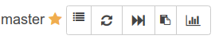

# Troubleshooting

When a build fails or a ci is missing it can be for multiple reasons, and runbot offers multiple features to fix this depending on the issue. Note that most actions are only available to logged in users. 

## Check batch informations

The batch view can offer precious informations, like not synchronous commit (the different branches where likely not rebased at the same time, on compatible commits) or the commits are maybe to old. In this case the first action should be to rebase all branches by ensuring to fetch all repo in the same time frame.

## Red build

A build can be red for an unrelated random error or time related errors. In this case the build can be replayed with a rebuild. It is also usefull to apply some changes made in the runbot backend (configuration changes, build errors disabling a specific tests, upgrade exception, ...)

Most of the time, in this case, a rebuild should be enough

Note that for build with children, it is usually enough to rebuild only the red child. This is faster and creates less load.

## Missing ci on github/other bot.

In some cases a signal between runbot and github, or github and mergebot can be lost on the path (network or github issues most of the time). In this case, a build can be green but the corresponding ci on github or on the mergebot dashboard can be missing.

There is a action to resend the last commit status of a commit for this purpose.

First access the commit page. Most of the commit sha displayed in the interface are clickable and will lead to the commit page.

Then in the top right part, click the refresh icon to send again the missing status.

## Invalid version

In some cases when creating a branch with an invalid name (not starting with `version-`) or creating pull request with an invalid target, It is possible that runbot will pick the wrong version. 
Usually, changing the target of a pr should be enough. If not, this can be fixed manually in the bundle view form by defining a forced version, you can ask someone with the correct access right to do so. In this case it will usually be needed to force a new batch (see next section)

## Invalid build parameters

If a rebuild can replay the exact same build, applying the changes made in the config if there were any, it won't change the build parameters. 

- commits
- version
- config to use
- config_data
- custom trigger (config to use, config data, extra params, dump)
- reference build ids (mainly for upgrades)

For that, it is sometimes needed to force a new batch. 

By default this will link all previous build that have the same parameters, but will allow to apply changes made on custom triggers (usually multi builds added on demand), update the reference build to use for upgrade (if the current one is) update the version (if it was used for this build and updated)

This is the action called when a new commit is detected in any repository.

This actions is only accessible for specific group, mainly to avoid confusion with the rebuild action: those action may create unnecessary load when used by mistake and even generate inconsistent ci because of parallel build running on the same commit.

The Automatic rebase action is similar, but will also simulate a rebase (apply the patch of the pr on the last commit of the base branch). This is only usefull for community pull request, where it is difficult to ask the developper to rebase, or for bundle containing an already r+ pr, to avoid the need to rebase and push and r+ again. In any other case, when pushing an update on the branch is not an issue, it is better to do a rebase locally and forcepush the branches.

